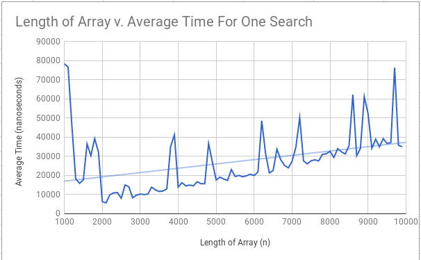

#### Team Shampooing et Conditionneur (Cheryl Qian, Stefan Tan, Lynne Wang)
#### APCS2 pd1
#### L00 -- But What Does the Data Say?
#### 2018-02-08

## Hypothesis
For an n x n 2D array of ints, the worst-case execution of our search algorithm is O(n).

## Background
For an assignment we were asked if it was possible to make an O(n) search algorithm for an n x n 2D array of ints, wherein numbers increase across any row (L-> R) and down any column. If we thought it was possible then we were told to make either a flowchart, pseudocode, or step-by-step recipe/procedure. If not, we were told to clearly state your case that it cannot be done by justifying/explaining it and using examples. When we came back the next day, all of us came up with a search algorithm that we believed has O(n) runtime. However, we were told that the only way to know for sure was through an experiment with a conclusive result. The goal of this lab is to prove that our search algorithm runs in linear time.   

## Experiment Methodology
We already have a search algorithm that we coded from a previous assignment and we were then given some methods to help us. We decided to use System.nanoTime(), which returns the time in nanoseconds from the most accurate system timer available. Since the computer runs the search algorithm quickly on small 2D arrays, such as 5 x 5 and 10 x 10 2D arrays, we decided to use 1000 x 1000 2D arrays to 9900 x 9900 2D arrays for a total of 90 2D arrays, incrementing the row and column of the 2D array by 100 for maximal results. We also decided to do 20 trials of the search algorithm to make sure outliers don't affect our conclusions. For all the 2D arrays, we searched for the worst-case scenario, which for our code is the element at the top right. We created a for loop to make the 2D arrays and also another for loop to run the search algorithm 20 times. We inserted System.nanoTime() right before the search and right after the search to make sure no other processes affect our data. We subtracted the time we got after the search and before the search to find out how long the search took. We then took the average times of the 20 trials for each 2D array.  

## Results

## Conclusions
The results from our experiment show that our search algorithm is O(n). Although there are random spikes in the graph, there is an overall linear trend, indicating that it runs in linear time. Therefore, our hypothesis is true. We believe that the huge time spike that occurs at the beginning of the graph could be atrributed to the system allocating memory for the 2D arrays. There are spikes that seem to happen at increments of about 1000, which may indicate that there is a maximum size for each time the JVM opens up a memory slot.
